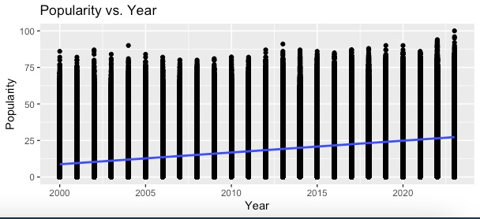
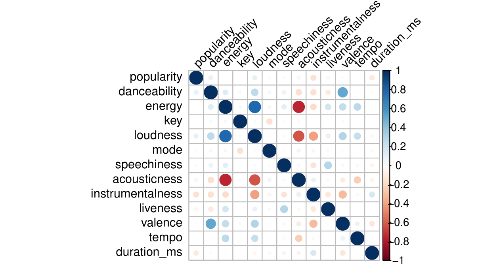

# Spotify Top Songs Analysis

I'm sure a lot of us have thought about what it would take to make a hit song. Song attributes can enable us to get an idea of just what makes our favorite tracks stand out. The analysis here attempts to predict the popularity of a song based on attributes such as 'danceability', 'energy', etc, as well as give us some insights based on genre and time of release.

### Broad Insights:

One of the best ways to begin is to analyze the popularity of different generes (note - there are many, many more genres than just these 10, but these were selected for being the most popular to make the graph more readable: 

As expected, we see pop songs have the highest popularity (it's in the name, right?), though the slope of the ridge is not very steep, indicating fair variance amongst different levels of popularity. Following a similar trend are hip-hop, dance, and indie-pop (though indie-pop has a fair distribution of songs with quite low popularity as well).

On a separate topic, the year of release also does have an impact on its popularity. This would make sense as with Spotify still growing in terms of its number of users, more and more people are likely to stream newer songs that at the time of course have a surge in popularity.

We can see a clear linear relationship between year and popularity. The slope of the line is _, indicating _.

### Regression Models and Predictions

Moving on from these broader insights, I want to see if we can build a predictive model to estimate the popularity of a song based on the internal song attributes. Rather than genre or year, the predictors describe the nature of the song itself in 12 ways: 'danceability', 'energy', 'loudness', 'speechiness', 'acousticness', 'instrumentalness', 'liveness', 'valence', 'tempo', 'duration_ms'.

To begin with, it seemed to me that there could be a degree of high multicollinearity between the predictor variables. I used the Variance Inflation Factor (VIF) method to test for this. 

The VIF values are not all that high. I was expecting to take action if they exceeded 5. Only two predictors come close to that, 'energy' and 'loudness'. Charting a correlation plot from a correlation matrix, we can see that 'energy' and 'loudness' have a fair degree of positive correlation with each other, and both have a fairly negative correlation with 'acousticness'. This could be something to keep an eye on:

### Multivariate Model:

To begin with, we can go with a regular multivariate regression approach. 

We can see that the p values all indicate a high degree of statistical significance for our predictor variables, a good start! The Adjusted R-squared value though is only 0.06752 though, indicating the model can only explain 6.75% of the variance in "popularity". Thus, while the overall regression model is statistically significant (as also confirmed by the F-statistic), it can only explain variance in popularity to a small degree.

Now I know blindly chasing after a higher R-squared value is not always the best approach, especially with a topic such as this where there can be so many outside factors influencing the popularity of the song that are not in this dataset (such as how the song was promoted, how it relates to the trends of the time, etc), but I do want to see if we can do better.

-1.png)

